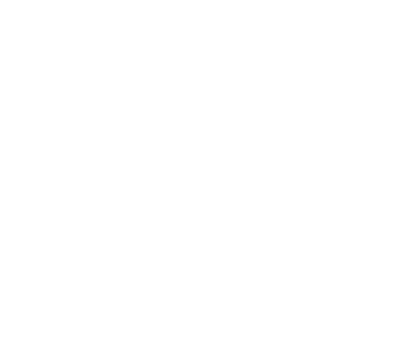

# AtCoder_Python

# Paper
|No.|Paper|
|---|---|
|001|[MyPage](https://atcoder.jp/users/InuDog9520)|
|002|[AtCoderProblems](https://kenkoooo.com/atcoder/#/table/InuDog9520)|

# 20250312
- 少しずつC問題とかも解けるようになってきた
- グリッドの問題や単純な全探索が苦手なので克服したい

# 20250313
- 辞書とかも使えるようになってきた
- グリッドは少しはましになったかも
- ABC308のC問題は普通に解くだけじゃ丸め込み誤差が生じてWAになる。事前に大きい数字を掛け算しておくことで整数部の大小比較をするようにする。

# 20250314
- 二分探索の問題を解いた
- ソート済み配列の検索くらいでしか二分探索を使ったことなかったが、最大・最小値を求めるのにも使えるということが分かった
- 明日は初のコンテスト参加、頑張るぞい！

# 20250315
- 初のリアルタイムコンテスト
- B問題が分からず沼って結局２完・・・
- せめてB問題までは解きたかったので非常に悔しい

# 20250316
- 前日のabc397の振り返りをした
- 少し蟻本をかじった

# 20250317
- 今日は少しだけ
- C問題も少し解けるようになってきた